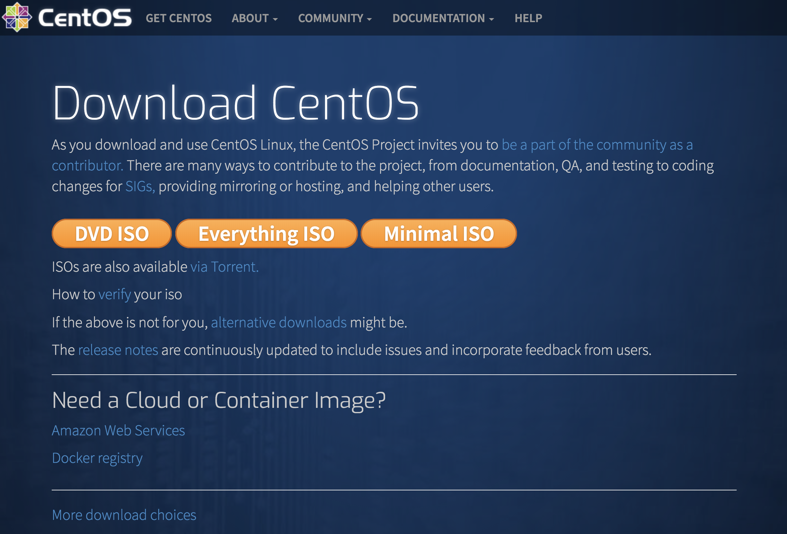
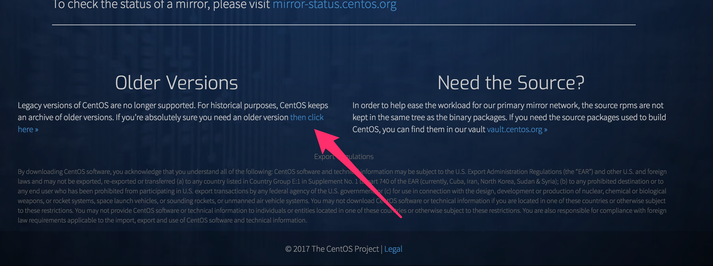
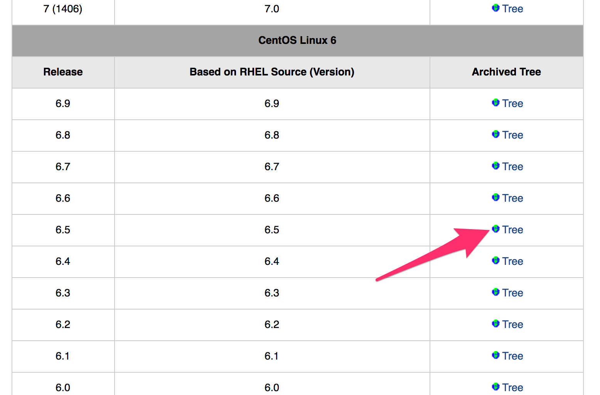
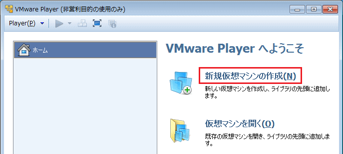
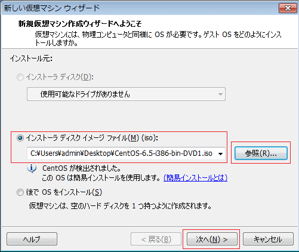
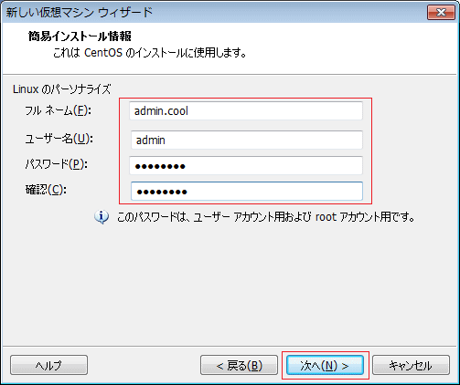
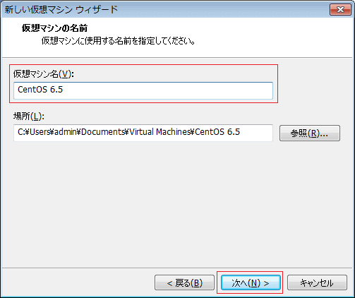
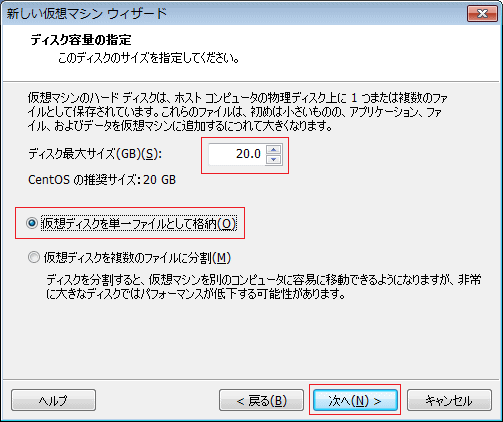
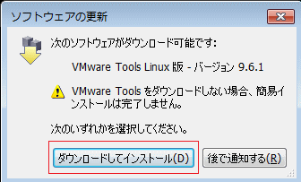

# How to CentOS6.5 on VMware14

## 1.CentOS6.5のダウンロード
- [CentOSダウンロードページ](https://www.centos.org/download/)



<br>

 今回は、CentOS6.5をダウンロードするため、ページ下にある、Older Versionsへ
 


<br>

 スクロールし、CentOS6.5のTreeをクリックする。



<br>

次に、
> isos/
>> x86_64/
>>> CentOS-6.5-x86_64-netinstall.iso/

<br>

USA:
> http://archive.kernel.org/centos-vault/
>> 6.5/
>>> isos/
>>>> x86_64/

と進んで行く。最後に、`CentOS-6.5-x86_64-bin-DVD1`(4GB)を選択し、ダウンロードする

<br>

## 2.VMware上でCentOSをインストール

*VMware Player* を起動し、「新規作成仮想マシンの作成」をクリックする。



<br>

 次に、ダウンロードしたファイルである、`CentOS-6.5-x86_64-bin-DVD1`を参照から選択する。
<br>
 正しく、参照されると「CentOSが検出されました。このOSは簡易インストールを使用します」と表示される。



<br>

 次に、アカウント情報の入力をする。「フルネーム」には適宜、自分の思った名前を入力する。<br>
 
```sh:ex)
フルネーム: popopopo
ユーザー名: s124****
パスワード: ********
```



<br>

　以下の画面が出たら、赤枠通り自分がダウンロードしたCentOSのversionを仮想マシン名に入力する。
　


<br>


 次に、ディスク容量の選択をする。CentOSのデフォルト推奨値では20.0とあるが、おそらく容量が足りなくなるため、`50.0GB`くらいにしておくのがベスト。次に、仮想ディスクを単一ファイルとして格納」または「仮想ディスクを複数のファイルに分割」については、自身の環境に応じて選択。



<br>

 特に問題がなければ、完了を選択し、以下が出るのを待つ。
 
 
 
<br>

以上が表示され、クリックするとインストールが開始される。

