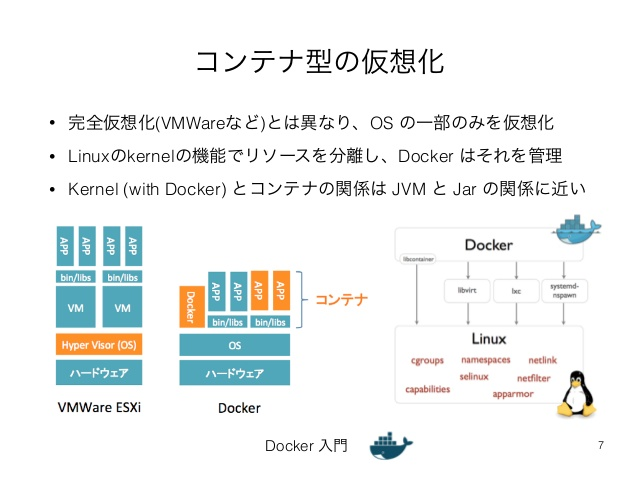

# Docker運用について

## Dockerとは？


　**Docker**（ドッカー）」とは、非常に軽量な**コンテナ型のアプリケーション実行環境**である。*dotCloud社（現Docker社）*が開発し、2013年にオープンソースのプロジェクトとして公開された。ソフトウェアの高速な配布・実行や容易なイメージのカスタマイズ、導入運用の手軽さ、豊富なプレビルドイメージの提供などの理由により、当初はソフトウェアの開発やテスト段階における利用が多かったが、現在ではパブリッククラウドからオンプレミスシステムまで、さまざまなシーンで急速に普及しつつある (参照: 下記)  
  
#### 早い・軽い
 OSレベルの仮想化なので、起動は一瞬で、コンテナ間でイメージを共有できるので、コンテナの起動自体ではディスクは消費する。  
  
   

#### Dockerイメージ、Docker Hub
 コンテナで利用するファイル・設定はDockerイメージとして、保存・再利用できる。 Docker Hubでは、多くのイメージ(30万以上)が公開されている。  

<br>
<br>

## 軽量なコンテナ型の仮想化環境Docker

　コンテナ型の仮想化環境とは、**Linuxカーネル**が持つ「**コンテナ**」機能などを使って、実行環境を他のプロセスから隔離し、その中でアプリケーションを動作させる技術である。  
　<br>
　
**コンテナ**はLinuxの通常のプロセスとほぼ同じものだが、利用できる**名前空間**や**リソース**が他のプロセスや**コンテナ**からは隔離され、それぞれ固有の設定を持てるようになっている。そのためコンテナ内のアプリケーションから見ると、独立したコンピュータ上で動作しているように振る舞う。コンテナを管理するコストはプロセスを管理するコストとほとんど変わらず、仮想マシンを管理するコストと比較すると非常に軽い。  

<!>**コンテナ**は**Linuxカーネル**が持つ次の機能を利用して実現されている。  
　

- **名前空間の隔離機能**

 ファイルシステムや**コンピュータ名**、**ユーザー名（ユーザーID）**、**グループ名（グループID）**、**プロセスID**、**ネットワーク機能**などを、コンテナごとに独自に設定できるようにする機能。  

- **リソースの隔離機能**

 **CPU**や**メモリ**、**ディスク**入出力など、コンテナ内で利用する**リソース**を他のコンテナから隔離したり、設定に基づいて振り分けたりする機能。  



<br>
<br>

## Dockerイメージとは？

　**Docker**ではアプリケーションとその実行環境、展開／操作方法（スクリプト）などをまとめて1つのパッケージにし、それを「**Dockerイメージ**」として保存／配布している。イメージは公式な「リポジトリ」で配布されているもの（ベースイメージ）を取得してきてもよいし、自作することもできる。  
  
<br>

　**Dockerイメージ**を***Docker Engine上で起動したものがDockerのコンテナになる。***そのコンテナ内で必要なアプリケーションをインストールして、各部をカスタマイズした後、それをディスクに保存すれば、新しいDockerイメージとして利用できる。イメージファイルは互換性が高く、これは基本的にはどのDockerホスト上でも動作する。

<br>
  
　ただ、この場合自分でのカスタマイズできない、ということが発生してしまう。この時に使われるのは、**Dockerfile**というスクリプト機能を使うことになる。このファイル中には、イメージに対して適用する指示を記述しておく。**Dockerfile**をベースとなるイメージに適用すれば、いつでも簡単に同じソフトウェア環境をすぐに用意できることになる。  
  
  
<br>
<br>

## Docker Machineとは？
　**Docker Machine**とは、仮想サーバの作成とDockerを自動インストールするコマンドラインツールである。ドライバの切り替えにより、ローカルの**VirtualBox**やリモートのクラウド環境を操作できる。
  作成した仮想サーバのIPアドレス表示やSSHログイン機能を備えており、クラウドのコンパネに触れなくても、一通りの操作を行える。
  `docker-machine`コマンドは、macOS, Windowsでも使える。
  
  
<br>
<br> 
 

## ボリュームの活用
 開発に役立つ**ボリューム機能**というものがある。**Dockerコンテナ**内は通常サーバ同様、１つのファイルシステムのみである。コンテナはその仕組み上、動的に変化するデータの保持には向いていない。**動的なデータ**を扱うためには、**ホスト側**にデータ保存用の特別なディレクトリを作成する**ボリューム機能**が役にたつ。

<br>

 
### ボリューム機能とは？
---
　コンテナのイメージレイヤとは別にデータを管理する仕組みである。通常のレイヤ操作とは異なり、Dockerホスト上のディスク領域をネイティブに読み書きでき、そのため。長期保管するようなデータが必要な場合に有用である。まあ、ホスト側のファイルやディレクトリのマウントもできるため、より迅速な開発に生かすことが可能である。

<br>

　ボリューム機能を使うことで、コンテナをイメージにコミットしたとしても、ボリュームの内容は反映されることはない。そのため、開発用のライブラリやシステムのバージョンが変わったとしても、ボリュームないのデータを気にせずに利用でき、また、ボリュームの実体はホスト上の`/var/lib/docker/volumes`ディレクトリ内である。

- myvolume　という名前のボリュームの作成  
```sh
$ docker volume create myvolume
```
  
- ボリューム一覧の表示  
```sh
$ docker volume ls
```
  
- ボリュームをコンテナ内の/dataとして使う場合  
```sh
$ docker run -it -v myvolume:/data ubuntu bash
```

- ボリュームの削除
```sh
$ docker volume rm <ボリューム名>
```
  
  
  
  
  
  
  
  
  
  
  
  
  
  
------------------------------------------------------!

<br>
<br>

<下記参照>

- [http://www.atmarkit.co.jp/ait/articles/1701/30/news037.html](http://www.atmarkit.co.jp/ait/articles/1701/30/news037.html)
- [https://www.google.co.jp/search?q=Docker+%E3%81%A8%E3%81%AF&rlz=1C5CHFA_enJP749JP749&oq=Docker+%E3%81%A8%E3%81%AF&aqs=chrome..69i57j69i65j69i61j0l3.2263j0j7&sourceid=chrome&ie=UTF-8](https://www.google.co.jp/search?q=Docker+%E3%81%A8%E3%81%AF&rlz=1C5CHFA_enJP749JP749&oq=Docker+%E3%81%A8%E3%81%AF&aqs=chrome..69i57j69i65j69i61j0l3.2263j0j7&sourceid=chrome&ie=UTF-8)
- [http://paiza.hatenablog.com/entry/docker_intro](http://paiza.hatenablog.com/entry/docker_intro)
