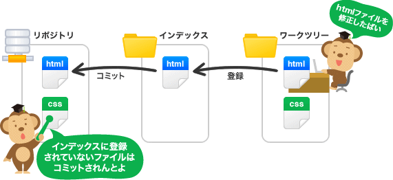

# gitの簡易情報
---

## gitのリポジトリを作成する

```sh
$ git init
```

- `.git` という名前の隠しディレクトリ(Gitのリポジトリ)がカレントディレクトリに作成される
- この`.git`に gitの情報が追加されていく

<br>

## git init ~ push してgithubに反映させるまでの流れ
```sh
git init
git add <アップさせたいファイルの指定>
git commit -m "<コミットしたコメント>"
git remote add origin git@github.com:<ユーザー>/<リポジトリ名>.git
git push origin master
```
- masterの部分は`<ブランチ名>`だから基本`master`
- 以上の流れでgithubにリポジトリを作成し、アップすることができる
<br>

**ここで上のcommandを掘り下げて行く**


<br>

### add
---
```sh
$ git add <ファイル名>
```
- ファイルやディレクトリを`.git`インデックスに追加
<br>

```sh
$ git add -A
```
- 全ての変更を含むワークツリーの内容をインデックスに追加
<br>

```sh
$ git add -u 
```
- 前にコミットしたことがあるファイルだけインデックスに追加
<br>

### commit
---
```sh
$ git commit
```
- インデックスに追加されたファイル等をコミット
<br>

```sh
$ git commit -m "<コメント>"
```
- コミットとコミットに対する内容を同時に追加
<br>

```sh
$ git commit -a
```
- 変更されたファイルをインデックスに追加 & コミット
<br>

```sh
$ git commit --amend
```
- 直前のコミットの修正
<br>

## git branch を作成してから mergeまでの流れ
```sh
git branch <ブランチ名>
git checkout <ブランチ名>
git add <ファイル名>
git commit -m "コメント"
git push origin <ブランチ名(checkoutしたブランチ名)>
git checkout master
git merge --no-ff <ブランチ名>
git push origin master  //<-でgithubにマージを反映
```
<br>

### git branch & checkout & merge
---

#### 作成
```sh
$ git branch <ブランチ名>
```
- これでブランチが作成される
<br>

#### ブランチの確認
```sh
$ git branch 
 * master
   <ブランチ名>
```
<br>

#### 削除
```sh
$ git branch -d <ブランチ名>
```
- 指定したブランチを削除
- マージしていないコミットが存在する場合はエラー
- マージしてなくても削除した場合は `-D`のオプション指定をする
<br>

#### ブランチの切り替え
```sh
$ git checkout <ブランチ名>
```
<br>

#### ブランチを作成しつつ、切り替え
```sh
$ git checkout -b <ブランチ名>
```
<br>

#### マージをする

先ほど流れのところで`--no--ff`というオプションをつけたが理由は以下のリンクを参照

- [gitのmerge --no-ff のススメ](http://qiita.com/nog/items/c79469afbf3e632f10a1)

<br>

## gitリポジトリをクローンする

```sh
$ git clone <リポジトリのパス>
```

<br>
ex)　実際にすると以下のようになる

```sh
$ git clone https://github.com/soeyusuke/C6
```
<br>

## git pull をしてカレントリポジトリを最新にする
```sh
$ git pull origin master
```
- 以上の流れで `master`ブランチのリポジトリを`pull`してカレントリポジトリを最新にする
<br>

## git の log を確認する
```sh 
$ git log --graph --oneline
```
- グラフ化された`log`を見ることができる


<br>

## git の差分を表示する
```sh
$ git diff
```
- インデックスとワーキングツリーの差分を表示
<br>

```sh
$ git diff <commit id 1> <commit id 2>
```
- 指定したコミット間の差分を表示
<br>

## .gitignoreとは？
Gitリポジトリにおいて、意図的に追跡対象から外したい（無視したい）ファイルを設定するためのファイル<br>
書き方については以下を参照すると良い

- [.gitignore の書き方](http://qiita.com/inabe49/items/16ee3d9d1ce68daa9fff)


## git submodule

### リポジトリを作る

Childディレクトリに移動して、

```sh
# Child
git init
git add .
git commit -m "first"
git remote add origin <ChildRemoteURL>
git push -u origin master
```

を実行し、Parentディレクトリに移動して、

```sh
# Parent
git init
git submodule add <ChildRemoteURL>
git add .
git commit -m "first"
git remote add origin <ParentRemoteURL>
git push -u origin master
```

submoduleの更新をした時、親リポのアップデート方法

```sh
git submodule update --remote --merge

```
これでParent配下のChildが最新版に更新されます


### 親プロジェクト側から子プロジェクトを更新する
---

Parentリポジトリで以下を実行します。

```sh
# Parent
git submodule foreach git add .
git submodule foreach git commit -m "2 on parent"
git submodule foreach git push
```

この時点でリモートのChildが更新されます。
Parentのリモートも更新するために以下を実行します。

```sh
# Parent
git add .
git commit -m "update child 2"
git push --recurse-submodules=check
```

最後のChildのローカルを更新するために、Childリポジトリで以下を実行します。

```sh
# Child
git fetch
git merge origin/master
```