# LINEBOT_INITIALIZE


### LINE BOTを始めようとする人向けです
--

## はじめに
**line bot**を利用するためには以下のものを準備する必要があります

- LINE BOT の個人アカウント
- サーバー
- SSL証明書

手順を踏んでやっていきましょう。


## LINE BOT Business アカウント

LINEの個人アカウントは持っていると想定して以下のことに進みます
[LINE BUSINESS CENTER](https://business.line.me/ja/services/bot) アクセスして作っていきます

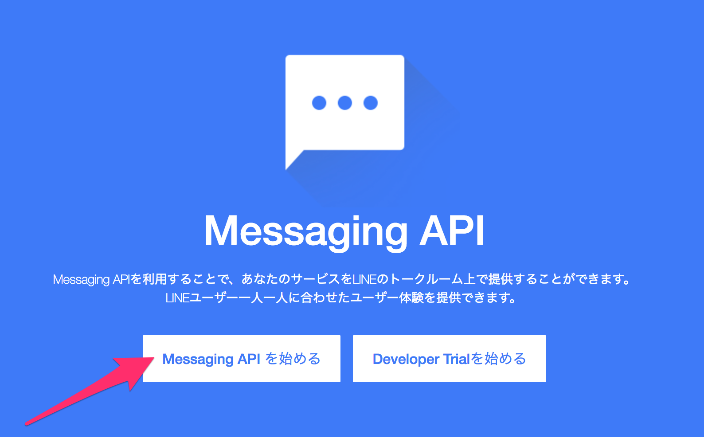
<br>
<br>

アクセスするとLINEの個人アカウントの認証のあるので、認証をしてください　その後、アカウント作成用のメールアドレスを登録します
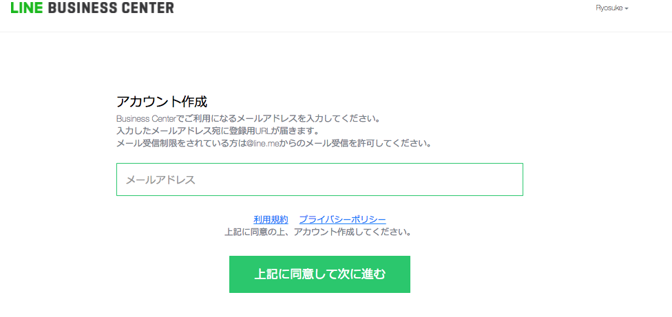
<br>
<br>

登録したメールアドレスにプロフィール登録用URLが届きます。登録用URLで、プロフィール情報を入力します
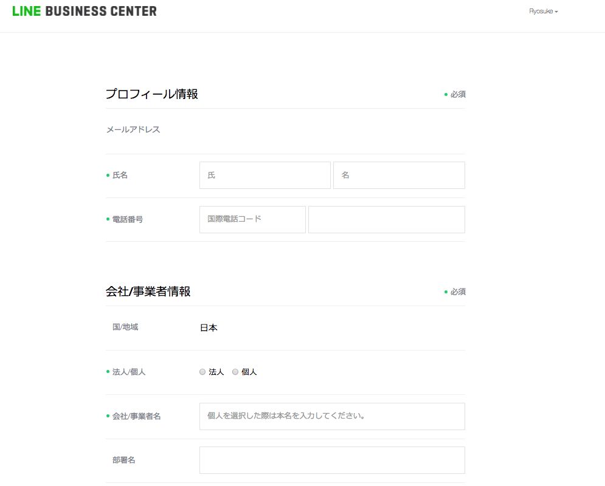
<br>
<br>

アカウントリストにいき、Messaging API に再びアクセスします。
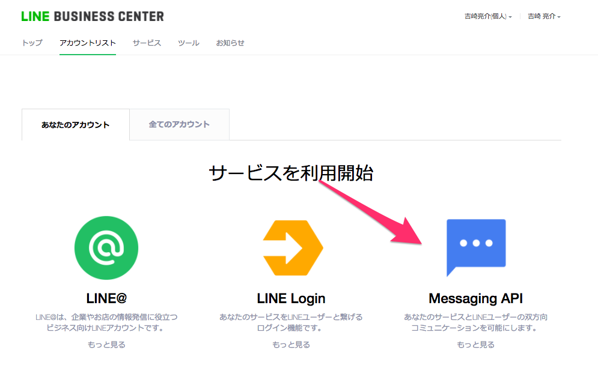
これで LINE BUSINESS アカウントの準備は完了となります。
<br>
<br>

## LINE BOT account 作成

次にアカウント作成に入ります、自分の好きなBOT名を入れます、
業種は**個人**の**学生**でいいと思います
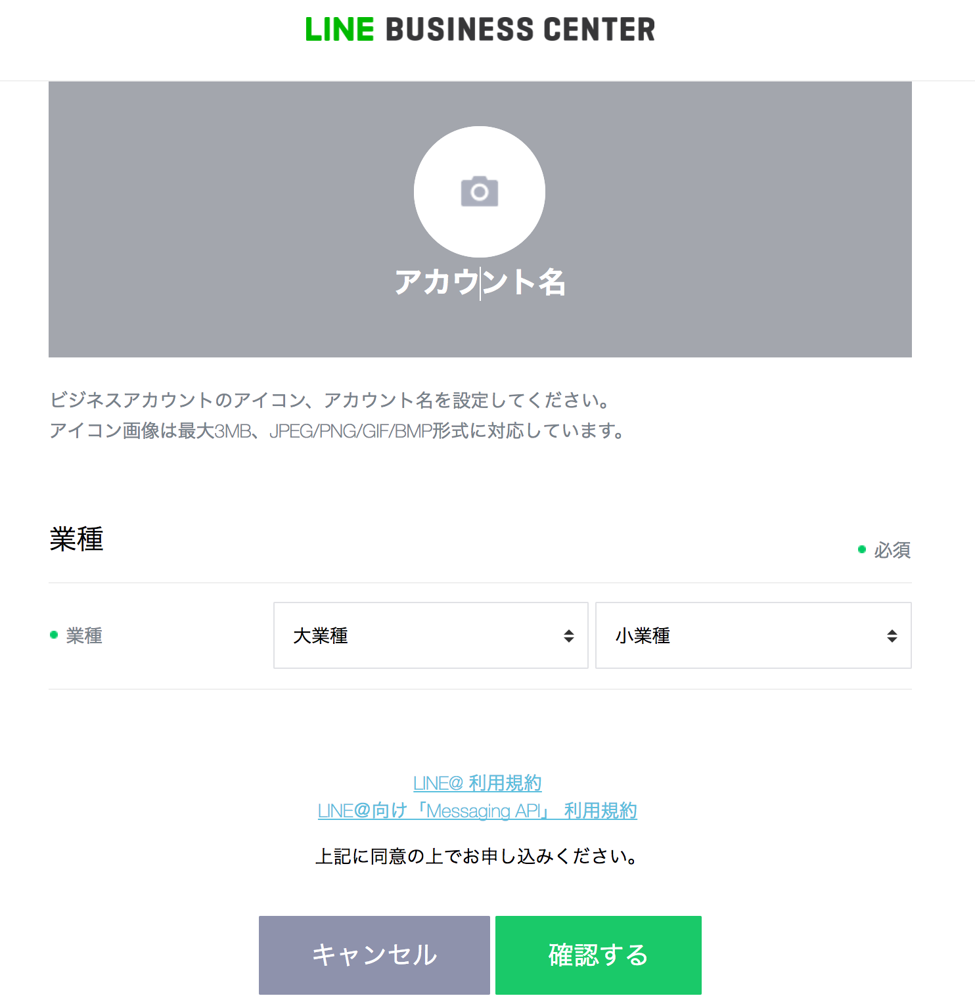
<br>
<br>

その後は、手順に沿って**LINE@MANAGER**に飛びます。
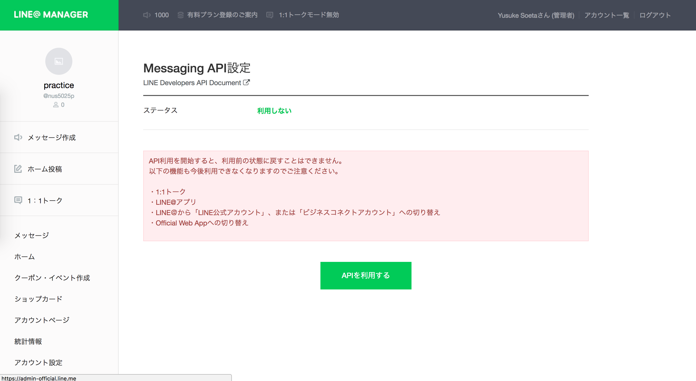
<br>
<br>

次に`webhook`等の設定をしていきます。
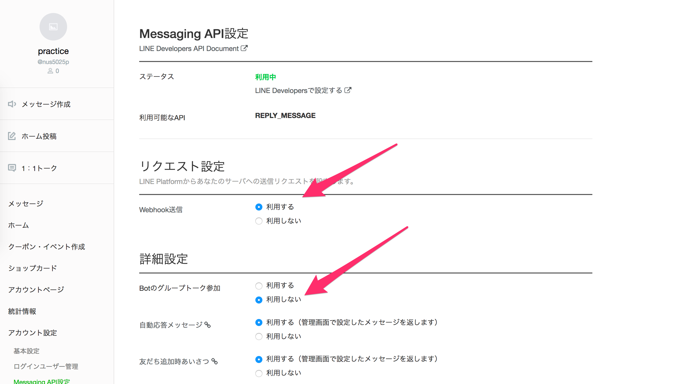
<br>
<br>

次に**LINE Developersで設定する**にアクセスします。
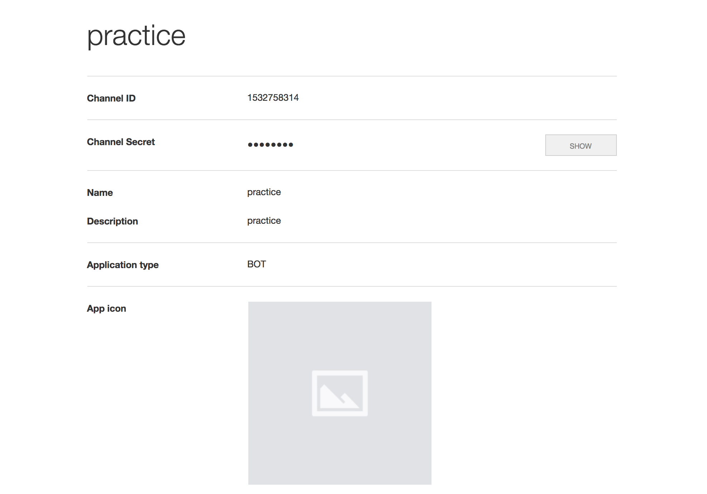
<br>
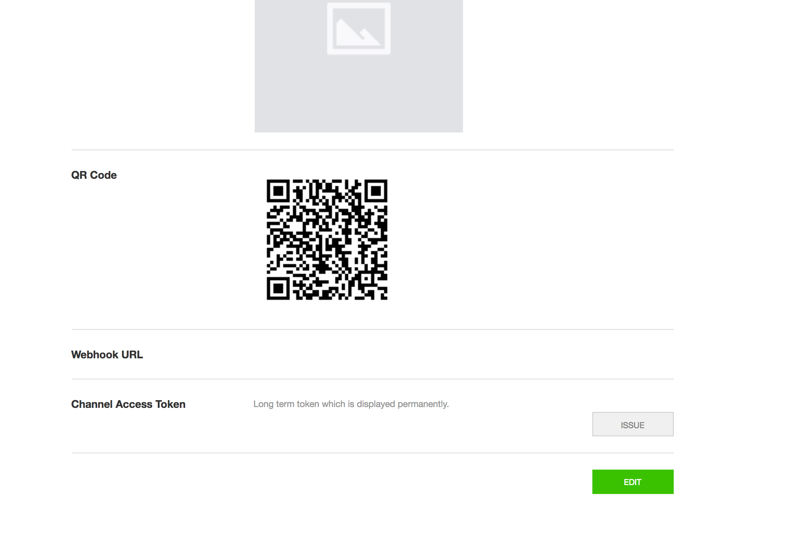
ここでは**LINE BOT**を作るのに必要な**channel seacret**と**channel access token**が発行できます。また、`Webhook URL`に設定するURLが自分で書くサーバーサイドの処理になります。
<br>
<br>


## サーバーの準備

以上でほとんどの準備ができたので、実際に実行して見ます。
プログラムは***golang***で書いていきます。

```go:
// オウム返し
package main

import (
        "log"
        "net/http"
        "os"

        "github.com/line/line-bot-sdk-go/linebot"
)

func main() {
        bot, err := linebot.New(
                os.Getenv("LINE_CHANNEL_SECRET"),
                os.Getenv("LINE_CHANNEL_TOKEN"),
        )
        if err != nil {
                log.Fatal(err)
        }

        // Setup HTTP Server for receiving requests from LINE platform
        http.HandleFunc("/callback", func(w http.ResponseWriter, req *http.Request) {
                events, err := bot.ParseRequest(req)
                if err != nil {
                        if err == linebot.ErrInvalidSignature {
                                w.WriteHeader(400)
                        } else {
                                w.WriteHeader(500)
                        }
                        return
                }
                for _, event := range events {
                        if event.Type == linebot.EventTypeMessage {
                                switch message := event.Message.(type) {
                                case *linebot.TextMessage:
                                        if _, err = bot.ReplyMessage(event.ReplyToken, linebot.NewTextMessage(message.Text)).Do(); err != nil {
                                                log.Print(err)
                                        }
                                }
                        }
                }
        })
        if err := http.ListenAndServe(":"+os.Getenv("PORT"), nil); err != nil {
                log.Fatal(err)
        }
}
```

というものを準備します。
`PORT`番号は9000番です。

<br>
上の設定ではローカルサーバーのためLINEでアクセスすることができません。そのため、localhostで動いているサーバーを、LANの外からアクセスできるようにできるツールである**ngrok**を使用して、LINE BOTを簡単に試運転できます。<br>
**ngrok**のinstall方法、使い方は以下を参考にしてください。<br>

- [ngrokの使い方（windows, mac）](http://qiita.com/Esfahan/items/74e71edfe17d9935d47e)
<br>
上の記事ではmacの時`./ngrok http 8888`となっていて、**ngrok**があるところでしか使えないようになっているので、`PATH`を通しておきましょう。
<br>
<br>

**ngrok**を実行すると、以下のようになります
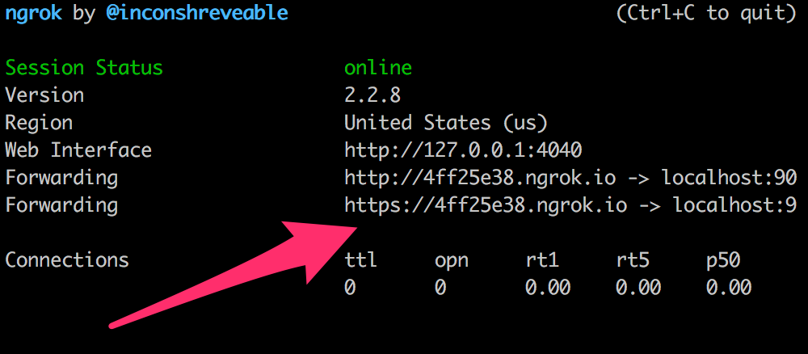
それの一番下の`URL`をコピーし、先ほど示した、`Webhook URL`のところに、**ngrok**のURL + `"/callback"`として追加します。
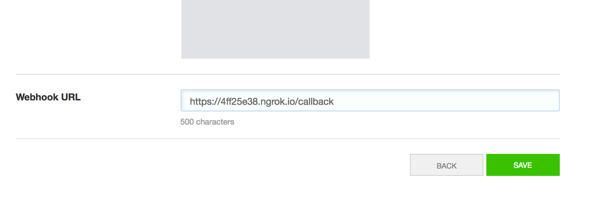
<br>
<br>


これで、準備は完了です。
実際に見ていきます。
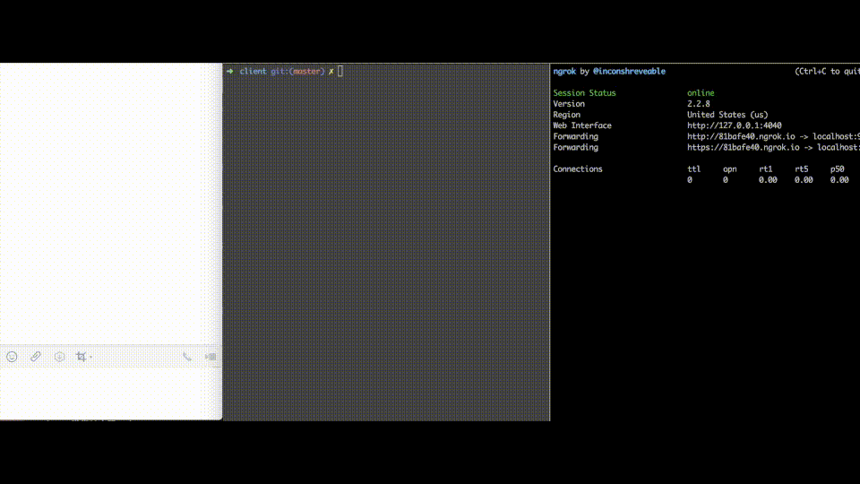
<br>
このように、レスポンスが返ってくるようになります。

## 最後に
このように、LINE BOTは簡単にできるので、みんなで各々が考えたBOTを作って見ましょう。
